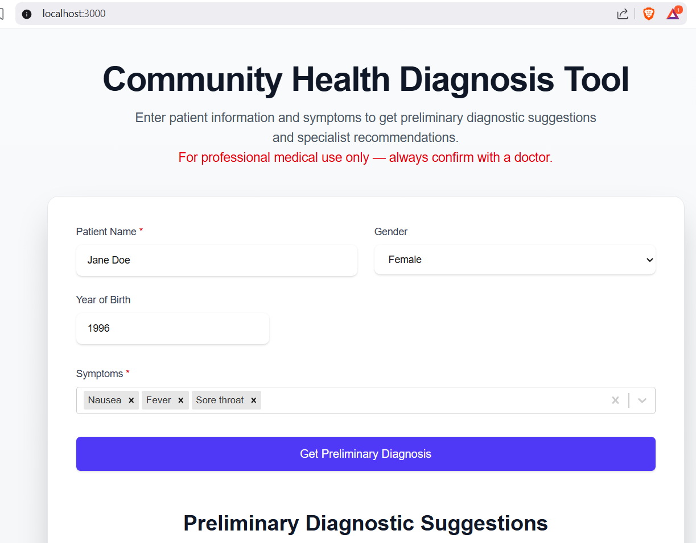
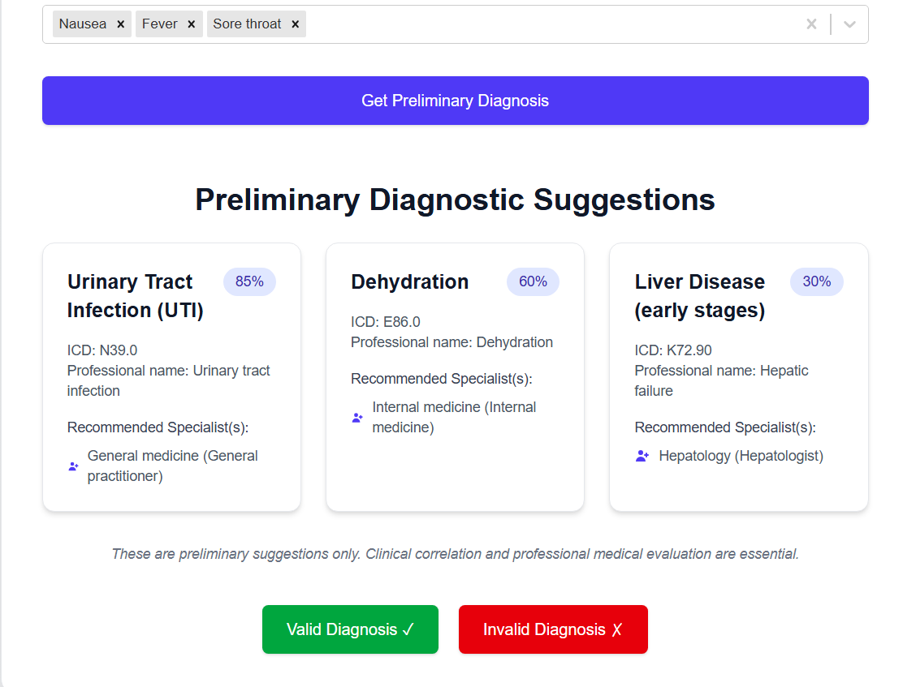
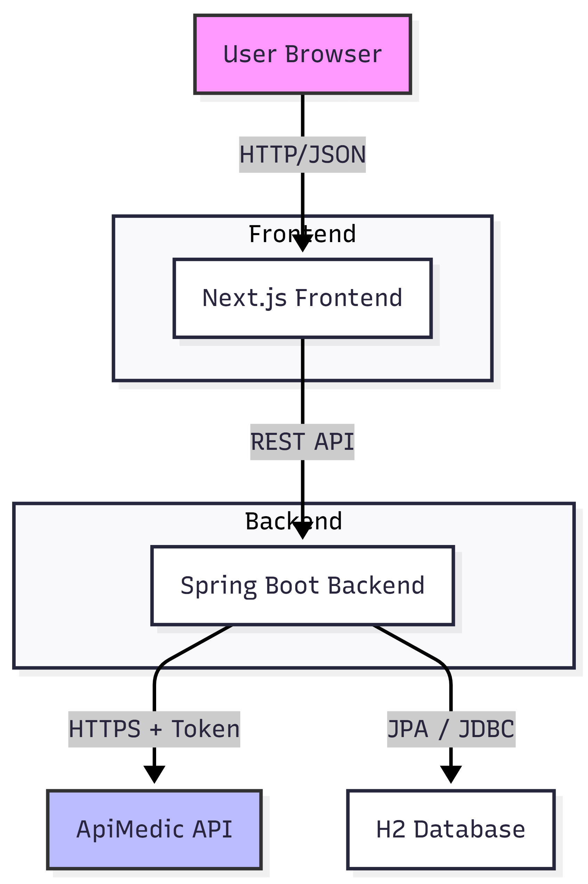
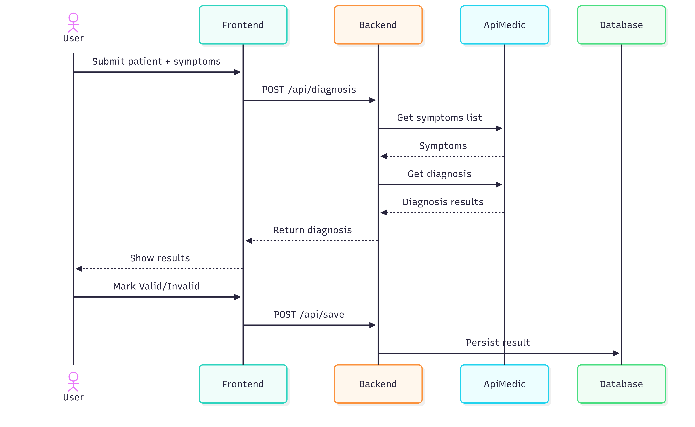

## Medical Diagnosis App
### Overview
A web-based app for preliminary medical diagnosis using ApiMedic API. Built with Next.js (frontend) and Spring Boot (backend). Supports symptom input, diagnosis retrieval, validation, and saving to DB with future integration with FHIR.



**Note:**
- ApiMedic requires signup for credentials (sandbox mode used). Replace placeholders in `application.properties`.

- I am mocking the APIMEDIC endpoints since I was unable to signup on `apimedic.com`. 
- To I have added a configuration `mockEnabled=true` to allow me to mock the apimedic. In order to disable the mocking, update `mockEnable=false`

```
This apimedic.com page can’t be found
No webpage was found for the web address: https://apimedic.com/signup
HTTP ERROR 404
```
### Technical Decisions
#### Frontend

- **Framework:** Next.js (over plain React) for SSR, routing, and API routes potential. Enhances SEO/performance.
- **State/UI:** React Hooks; react-select for symptoms; Tailwind CSS for styling (responsive, utility-first).
- **HTTP:** Axios (promise-based, interceptors for auth if needed).
- **Why?:** Modern, fast development; easy to extend with pages/components.

#### Backend

- **Framework:** Spring Boot 3.x with MVC (Controller-Service-Repository pattern).
- **HTTP Client:** RestClient (fluent, modern over RestTemplate).
- **Database:** H2 embedded (dev ease); JPA/Hibernate for ORM.
- **ApiMedic:** Token via HMAC-MD5; symptoms/diagnosis endpoints.
- **Error Handling:** Custom exceptions; HTTP status codes.
- **Why?:** Enterprise-ready; auto-config; scalable.

#### Other

- **Build Tools:** npm (frontend), Maven (backend).
- **Testing:** Not included (focus on design); add Jest/JUnit later.
- **Security:** Env vars for secrets; CORS for localhost.
- **Performance:** Synchronous; add Redis cache for symptoms.

#### Prerequisites

- Node.js 18+
- Java 22+
- Maven 3.8+
- ApiMedic account (username/password for sandbox).

#### How to Run the Application
##### Backend

1. Clone repo: git clone https://github.com/edewajosh/health-diagnosis.git
2. Navigate: `cd health-diagnosis/MedicalDiagnosis`
3. Update `src/main/resources/application.properties`
```
apimedic.username=your_username@email.com
apimedic.password=your_password
```

4. Build/Run: `mvn clean install && mvn spring-boot:run`
5. Runs on http://localhost:8080
6. H2 Console: http://localhost:8080/h2-console (JDBC URL: jdbc:h2:mem:testdb; user=sa; pw=password)


##### Frontend

1. Navigate: `cd frontend-app`
2. Install: `npm install`
3. Run: `npm run dev`
4. Runs on http://localhost:3000
Access app in browser.


### Full Flow

1. Start backend first.
2. Open frontend → Select symptoms, enter details → Get Diagnosis.
3. View results → Mark valid/invalid → Saves to DB (check H2 console).

### Troubleshooting

- CORS errors: Ensure backend has @CrossOrigin.
- ApiMedic fails: Check credentials; sandbox limits.
- DB: Schema auto-created; data persists in memory (restart clears).

### Future Improvements

- Add user auth (OAuth2).
- Integrate real scheduling (e.g., Twilio for SMS).
- Deploy: Docker Compose for local; Kubernetes for prod.
- Monitoring: Add Prometheus/Spring Actuator.

## High-Level Design (HLD)
### Overview
The application is a full-stack web app for preliminary medical diagnosis at a community health facility. It follows a **client-server architecture** with a React-based frontend (using Next.js for SSR and routing) and a Java Spring Boot backend (MVC pattern). The system integrates the ApiMedic API for symptom-based diagnosis, stores results in an embedded H2 database, and incorporates FHIR standards for standardized health data representation.
Key goals:
- __Modularity:__ Separate concerns (UI, business logic, data access).
- __Scalability:__ Designed for easy extension (e.g., add authentication, microservices).
- __Interoperability:__ FHIR integration for potential EHR integration.
- __Security/Compliance:__ Basic handling of sensitive data; notes for HIPAA-like compliance.
Performance: Synchronous API calls with potential for caching.

### System Components

1. __Frontend (Next.js with React):__ Handles user input (patient details, symptoms), displays diagnoses, and allows validation/saving. Uses Tailwind CSS for responsive UI.
2. __Backend (Spring Boot MVC):__ Processes requests, integrates ApiMedic, generates FHIR bundles, persists data.
3. __External API (ApiMedic):__ Provides symptom lists and diagnoses (sandbox mode).
Database (H2): Embedded for dev; stores diagnosis results with FHIR JSON.
FHIR Library (HAPI FHIR): Creates standardized resources (Patient, Observation, Condition).


_Designed using Mermaid_

### Data Flow

1. User selects symptoms, gender, birth year, patient name → Frontend sends POST to `/api/v1/diagnosis`.
2. Backend authenticates ApiMedic token → Calls diagnosis endpoint  → Returns results.
3. User views results → Marks valid/invalid → Frontend sends POST to `/api/save` → Backend persists to DB.

### Non-Functional Requirements

- Availability: 99% (local dev; prod would use cloud hosting).
- Security: API keys in env vars; no auth for demo (add JWT for prod).
- Performance: <2s response time; cache symptoms list.
- Tech Stack Rationale:
    - Frontend: Next.js over plain React for SSR/SEO; Tailwind for rapid styling.
    - Backend: Spring Boot for enterprise-grade MVC;  RestClient for modern HTTP.
    - DB: H2 for simplicity; migrate to PostgreSQL for prod.
    - FHIR: Enhances interoperability; positions for future integrations (e.g., HL7 standards).


### Assumptions & Constraints

- ApiMedic sandbox used (limited transactions; prod needs paid account).
- No real scheduling/claims (focus on core: diagnosis & save).
- Vital signs collection: Not implemented (extension point noted).
- Location: Assumes Nairobi-based facility; timezones handled via Java/JS defaults.

## Low-Level Design (LLD)
### Frontend Components (Next.js)

- __Pages:__ / (Home: main form & display).
- __Components:__
    - SymptomSelector: react-select for multi-symptom pick (options from API).
    - DiagnosisDisplay: Renders diagnosis cards with accuracy, ICD, specialists.
    - Button: Reusable UI with variants (primary, success, danger).

- State Management: React Hooks (useState, useEffect); no Redux (simple app).
- API Calls: Axios for GET/POST; error handling with alerts.
- Styling: Tailwind CSS classes for responsive grid/layout.

### Backend Components (Spring Boot)

- MVC Layers:
    - Controller: DiagnosisController - Handles REST endpoints.
    - Service: DiagnosisService - Business logic (ApiMedic calls, DB ops).
    - Repository: DiagnosisRepository - JPA for CRUD.
    - Entity: DiagnosisResult - Maps DB table.

- HTTP Client: RestClient for ApiMedic calls (fluent, error-handling).
- Config: application.properties for ApiMedic creds; FhirConfig for context.

### API Endpoints

1. `/api/v1/symptoms` - Fetch symptom list. 

Response
```
[
  {
    "id": "10",
    "name": "Headache"
  },
  {
    "id": "15",
    "name": "Fever"
  }
]
```
2. `/api/v1/diagnosis`

Request
```
{
  "gender":"male", 
  "yearOfBirth":"30", 
  "patientName":"John Doe", 
  "symptoms": [{
    "id": "1",
    "description": "Fever"
  },
  {
    "id": "2",
    "description": "Cough"
  }]
}
```
Response
```
[
  {
    "issue": {
      "id": "100",
      "name": "Urinary Tract Infection (UTI)",
      "accuracy": "85",
      "icd": "N39.0",
      "profName": "Urinary tract infection"
    },
    "specialisation": [
      {
        "id": "5",
        "name": "General practitioner",
        "specId": "5",
        "specialistName": "General medicine"
      }
    ]
  },
  {
    "issue": {
      "id": "150",
      "name": "Dehydration",
      "accuracy": "60",
      "icd": "E86.0",
      "profName": "Dehydration"
    },
    "specialisation": [
      {
        "id": "10",
        "name": "Internal medicine",
        "specId": "10",
        "specialistName": "Internal medicine"
      }
    ]
  },
  {
    "issue": {
      "id": "210",
      "name": "Liver Disease (early stages)",
      "accuracy": "30",
      "icd": "K72.90",
      "profName": "Hepatic failure"
    },
    "specialisation": [
      {
        "id": "25",
        "name": "Hepatologist",
        "specId": "25",
        "specialistName": "Hepatology"
      }
    ]
  }
]
```

### Database Schema

- Table: diagnosis_result
    - id: BIGINT PK AUTO
    - symptoms: VARCHAR (JSON array)
    - patient_name: VARCHAR
    - gender: VARCHAR
    - year_of_birth: VARCHAR
    - diagnosis: TEXT (JSON)
    - is_valid: BOOLEAN
    - timestamp: TIMESTAMP
### Sequence Diagram

_Designed using Mermaid_

### Edge Cases & Error Handling

- **Invalid symptoms:** Return 400 Bad Request.
- **ApiMedic token fail:** Retry once; throw RuntimeException.
- **DB errors:** Spring's @Transactional rollback.

### Extension Points

- **Unit tests:** Add tests for both frontend and the backend application
- **Add auth:** Spring Security JWT.
- **Scheduling:** Integrate calendar API (e.g., Google Calendar).
- **Claims:** Add endpoint for PDF generation/submission.
- **Prod:** Dockerize, deploy to AWS/Kubernetes.